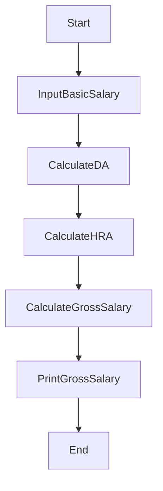

# Ramesh’s basic salary is input through the keyboard. His dearness allowance is 40% of basic salary, and house rent allowance is 20% of basic salary. Write a program to calculate his gross salary.
Hint: Gross Salary = Basic Salary + DA + HRA

Write an algorithm, flow-chart and C++ code

_____________
### Algorithm
_______
1. Input BasicSalary, GrossSalary, DA, HRA
2. Calculate DA= BasicSalary x 40 /100
3. Calculate HRA= BasicSalary x 20 /100
4. Calculate GrossSalary = BasicSalary + DA + HRA
5. Print GrossSalary

__________________
### Flow-chart
_______


__________
### C++ code
______
```c++
#include <iostream>
using namespace std;
int main() {
int BS,HRA,DA,GS;
  cout<<"Type Basic Salary ";
cin>>BS;
DA=BS*40/100;
HRA=BS*20/100;
GS=BS+DA+HRA;
cout<<" Your Gross salary is ";
cout<<GS;
  return 0;
}
```
