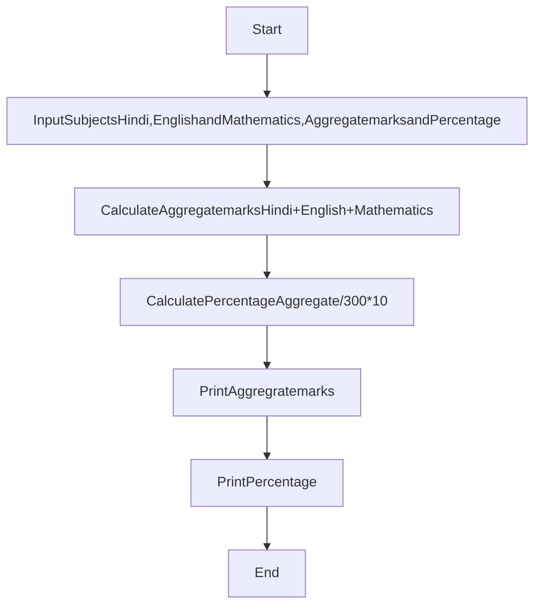

# If the marks obtained by a student in three different subjects are input through the keyboard, find out the aggregate marks and percentage marks obtained by the student. Assume that, maximum marks that can be obtained by a student in each subject is 100. 
Hint: Use subjects as Hindi, English and Mathematics.
____________
### Algorithm
________
1. Input  subjects as Hindi, English and Mathematics, Aggregate marks(grand total) and Percentage.
2. Calculate Aggregate marks= Hindi + English + Mathematics
3. Calculate Percentage = Aggregate /300 * 100
4. Print Aggregrate marks
5. Print Percentage 

________
### Flow-Chart
__________



____
### C++ code
________
```c++
//Online C++ compiler to run C++ program online
#include <iostream>
using namespace std;
int main() {
float Hindi,English, Mathematics,Aggregatemarks,Percentage;
  cout<<"Input Hindi Marks out of 100 ";
cin>>Hindi;
  cout<<"Input English Marks out of 100 ";
cin>>English;
  cout<<"Input Math Marks out of 100 ";
cin>>Mathematics;
cout<<endl;
Aggregatemarks=Hindi+English+Mathematics;
Percentage=Aggregatemarks /300*100;

cout<<"**********************";
cout<<endl;
cout<<" Your Total marks are: "<<Aggregatemarks;
cout<<endl;
cout<<" Your Percentage is: "<<Percentage;

  return 0;
}
````
